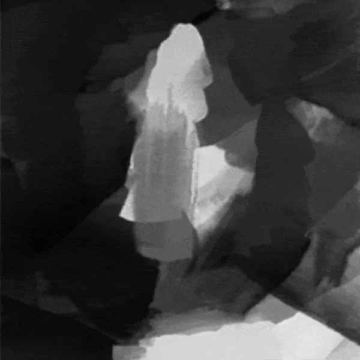
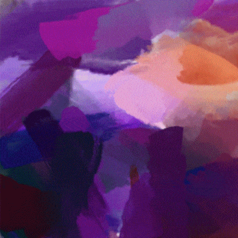

Procedural Painting Using Genetic Evolution Algorithmen in Unity 3D with compute shaders
=================

This repo contains code for a genetic evolution algorithm implmented in compute shaders in Unity 3D. If you are interested in using the project to generate your own paintings, have a look at the later section of this document or the [Quick Start Page](https://github.com/IRCSS/Procedural-painting/wiki/Quick-Start). For more information on the algorithm and the project itself, read my blog post on medium: https://medium.com/@shahriyarshahrabi/procedural-paintings-with-genetic-evolution-algorithm-6838a6e64703

In the post I go more indepth about the different sections of the pipeline and explain the major parts of the technique. As for information on the source code, the code is well documented.

-----
Copy of the [Quick Start Page](https://github.com/IRCSS/Procedural-painting/wiki/Quick-Start)

# Getting Started with the Project
If you wish to use this project to generate some paintings of your photos, all you have to do is download the content of this repository, download Unity, drag your photo in the inspector and press play. 

#### Unity Version and Platform
I am using **Unity 2019.1.14f1** on Windows (**DirectX11**). I have now ported the code on OpenGL 4.5 as well, but also tested only on windows. I would recommend you open the project with the same version. If you are on a different platform and using OpenGl, it can be that there are further platform differences I am not aware of which cause issues. Just make sure that Unity is used OpenGL and not Vulkan or Metal. (per default it is chosen automaticly, you can change this in Player Settings). Let me know if that is the case, we might find a fix. 

#### Control Center
After you download the the project, open the Main scene in Assets/Scenes. There is a *Manager* Gameobject, if you click on that, in your Inspector, you will see a *Evolution Manager* attached as a component to this Game Object. This component is the control center of the whole project. 

#### Importing your own Images
You can drag and drop your image in the *Image to Reproduce* property. If it is black and white, check the black and white bool. 

To use your own images first use a image editing software to make sure the image is **square** and has **power of two** dimensions (for example 1024 in 1024).  I am not quite sure what will happen if you give it a non square, non power of two image. Depending on your platform, it might work or it might not. I might fix this in the future so that it takes any size. 

Once you have your image in square format import your image somewhere in Unity. Then click on the image and in its property section make sure the maximum image size is set to 1024  (for performance reasons) and wrap mode is set to clamp.

Once these steps are done, drag and drop your image in the *Image to Reproduce* panel. 

#### Chose a Run Setting
The last property you need to be aware of is the *Run Setting*. This setting determines how long the painting will take and how detailed it will be. I have prepared 4 presets in the Assets/Settings folder which you can use. The settings are named after how long they take to finish the painting on my Nvidia 2070 graphic card. If you are experiencing performance issues, either reduce the image size, or head to the settings and reduce on each Stage Series the *Population Pool Number.*

Here is a visual example of how an image looks on 15, 30 and 2 and half hour run with different settings. If you wish to create your own Settings, have a look at the [Create You Own Settings Page](https://github.com/IRCSS/Procedural-painting/wiki/Create-Your-Own-Settings). This will give you the ability to do things like [Create Your Own Brushes](https://github.com/IRCSS/Procedural-painting/wiki/Create-Your-Own-Brushes).  
      

### Run the Painting
To start the painting, once you have selected your desired settings press Play in the editor. If all is set correctly, the painting will start and you can view the progress in the Game Window. 

If you open your Console, you will see information being printed about the process in real time. The most relevant info there is the *Current Stage*.  Once this value hits 0, that means your painting is finished. 

